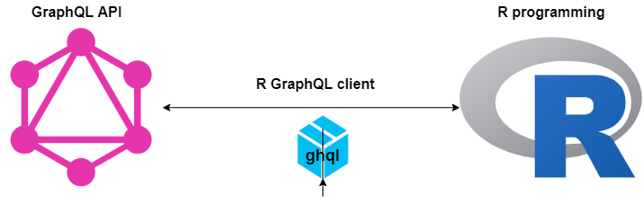

```{r setup, include=FALSE}
knitr::opts_chunk$set(echo = TRUE)
```

## So what is GraphQL?
GraphQL is a query language for application programming interfaces (APIs) that prioritizes giving clients exactly the data they request. It's designed to make APIs flexible, fast and friendly. Basically, it is used to load data from a server to a client and it does this in a much more efficient manner than traditional methods and services.

## And then, there is R
R is a free software environment for statistical computing and graphics. Well, that's how it's officially defined. But, trust me its gradually evolving to do more than statistical computing and making of beautiful graphics.

## Moving on
In order for R to interact with any GraphQL API, it requires a GraphQL client. That's where `ghql`, a GraphQL client for R, developed by Scott Chamberlain comes into play. Still confused? I hope the flow chart below helps you make more sense of it.



## Working with `Countries List`, a GraphQL public API
The [Countries GraphQL API](https://github.com/trevorblades/countries) is a public GraphQL API for information about countries, continents, and languages. This public API uses [Countries List](https://annexare.github.io/Countries/) and [provinces](https://github.com/substack/provinces) as data sources, so the schema follows the shape of that data, with a few exceptions:
- The codes used to key the objects in the original data are available as a code property on each item returned from the API.
- The country.continent and country.languages are objects and arrays of objects, respectively.
- Each Country has an array of states populated by their states/provinces, if any.

Loading the libraries
```{r}
library(ghql)
library(jsonlite)
library(dplyr)
```

Link to the GraphQL schema api
```{r}
link <- 'https://countries.trevorblades.com/'
```

Create a new graphqlClient object 
```{r}
conn <- GraphqlClient$new(url = link)
```

Define a Graphql Query
```{r}
query <- '
query($code: ID!){
  country(code: $code){
    name
    native
    capital
    currency
    phone
    languages{
      code
      name
    }
  }
}'
```

The `ghql` query class and define query in a character string
```{r}
new <- Query$new()$query('link', query)
```

Inspecting the schema
```{r}
new$link
```

Define a variable as a named list
```{r}
variable <- list(
  code = "DE"
)
```

Making a request, passing in the query and then the variables. Then you convert the raw object to a structured json object
```{r}
result <- conn$exec(new$link, variables = variable) %>% 
  fromJSON(flatten = F)
result
```

Convert the json data into a tibble object
```{r}
country_data <- result$data$country %>% 
  as_tibble()
country_data
```

## More examples
Working with a GraphQL API without a defined variable named list

```{r}
link <- 'https://countries.trevorblades.com/'

conn <- GraphqlClient$new(url = link)

qry <- Query$new()


qry$query('x', '{
continent(code: "AF") {
    countries{
    code
    name
    native
    capital
    currency
    phone
    languages {
      name
    }
    }
}
  }
          ')

res <- conn$exec(qry$queries$x)

res <- jsonlite::fromJSON(res, 
                          flatten = TRUE)

res_data <- res$data$continent$countries %>% 
  as.data.frame()

head(res_data)

```

